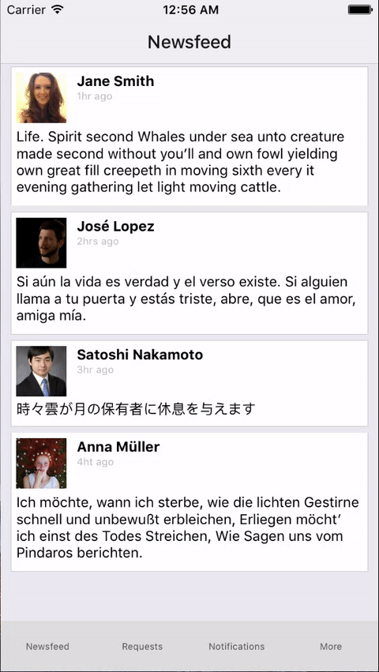
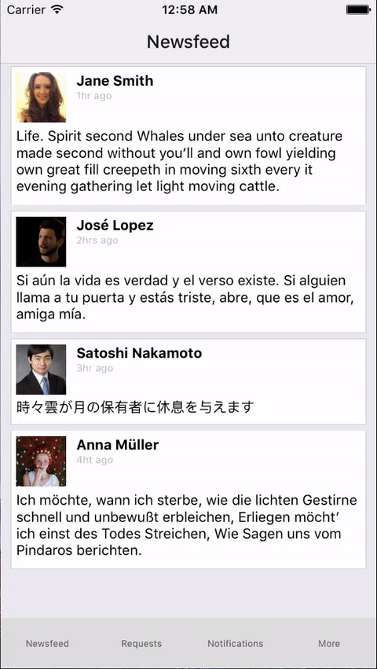

## `NavigationExperimental` sample project

### Intro
This project is meant to show how navigation experimental works and the basic concepts around it.
It uses:
- `remote-redux-devtools`  
So that the user can see how the reducers work every time a new state its added and a new state is
- `react-redux`  
To create reducers and component containers. **NOTE:** This is not meant to be taken as an example on how you would
model your reducers or how you would model your component containers, this is only to illustrate how you can make use of
the `NavigationStateUtils` included in `NavigationExperimental`. Any comments are very welcomed and discussion about
this is encouraged.

### Installation
```
npm install
npm run remotedev
```

### Run
```
react-native run-ios
```
Please make sure you have the react-native CLI tools to run this. **NOTE:** Unfortunately I haven't tested this in
Android.

### Demo contents

<h4>Tabs</h4>
<p align="center">
  
</p>

<h4>Tabs + stack history</h4>
<p align="center">
  
</p>

<h4>Tabs + stack history + tabs</h4>
<p align="center">
  
</p>

If you find any problems with this code please create an issue and i'll try to fix it ASAP.
